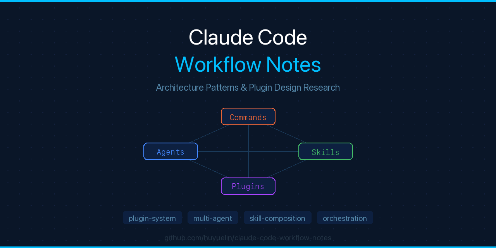

<div align="center">



# Claude Code Workflow & Internals Research

[](LICENSE)
[](https://claude.ai/code)
[](https://github.com/huyuelin/claude-code-boss-mode)

</div>

> **Official Position**: This repository is public analysis of Claude Code's documented architecture patterns, NOT based on leaked source code. All observations are from public repositories, official documentation, and reverse-engineering through official interfaces.

This is a research notebook on how Claude Code orchestrates multi-agent workflows, plugin systems, and skill composition. It documents the patterns Boss Mode leverages to integrate as a native Claude Code plugin.

## Table of Contents

1. [Claude Code Architecture Overview](#claude-code-architecture-overview)
2. [Plugin System Design](#plugin-system-design)
3. [Command & Agent Orchestration](#command--agent-orchestration)
4. [Skills System](#skills-system)
5. [Multi-Agent Workflow Patterns](#multi-agent-workflow-patterns)
6. [Boss Mode Integration Points](#boss-mode-integration-points)

---

## Claude Code Architecture Overview

### Core Components

Claude Code is a CLI-based AI coding assistant built on:
- **Runtime**: Bun (fast JavaScript/TypeScript execution)
- **Language**: TypeScript (strict mode)
- **Terminal UI**: React + Ink (interactive CLI components)

### High-Level Stack

```
┌─────────────────────────────────┐
│   Claude API (LLM Interface)    │
└──────────────┬──────────────────┘
               │
┌──────────────▼──────────────────┐
│  Query Engine / Orchestrator    │  ← Coordinates tools, agents, context
└──────────────┬──────────────────┘
               │
      ┌────────┼────────┐
      │        │        │
┌─────▼─┐  ┌──▼──┐  ┌──▼──┐
│ Tools │  │Agents│  │Tasks│  ← Extensible subsystems
└───────┘  └──────┘  └─────┘
      │        │        │
      └────────┼────────┘
               │
   ┌───────────┴──────────┐
   │ Plugin / Skill Loader │  ← Extension discovery
   └──────────────────────┘
```

### Directory Organization

```
src/
├── commands/           # 103+ slash commands
├── tools/              # 45+ tools (Bash, File, Git, Web, etc.)
├── skills/             # Bundled skill definitions
├── plugins/            # Plugin registry & loader
├── agents/             # Agent definitions
├── coordinator/        # Multi-agent orchestration
├── services/           # API, MCP, OAuth, LSP
└── types/              # Type definitions (command, plugin, skill, etc.)
```

---

## Plugin System Design

### Plugin Manifest Format

A Claude Code plugin declares itself via `plugin.json` or `manifest.json`:

```json
{
  "name": "boss-mode",
  "version": "1.0.0",
  "description": "Boss layer for Claude Code",
  "author": { "name": "Author", "email": "author@example.com" },
  "repository": { "type": "git", "url": "git@github.com:user/repo.git" },
  "commandsPath": "commands",
  "agentsPath": "agents",
  "skillsPath": "skills",
  "hooksConfig": { /* post-sampling hooks */ },
  "mcpServers": { /* MCP server definitions */ },
  "lspServers": { /* LSP server definitions */ }
}
```

### Plugin Components

A plugin can provide:

| Component | Location | Format | Purpose |
|-----------|----------|--------|---------|
| **Commands** | `commands/` | `.md` or `.ts` files | Slash commands (e.g., `/boss`, `/boss-pr`) |
| **Agents** | `agents/` | `.md` or `.ts` files | Multi-step agents that coordinate tools |
| **Skills** | `skills/` | `.md` with frontmatter | Reusable workflows and patterns |
| **Hooks** | (inline) | Config object | Post-sampling logic to modify outputs |
| **Output Styles** | `output-styles/` | `.ts` files | Custom terminal formatting |

### Plugin Loading Strategy

1. **Discovery**: Claude Code scans `.claude/plugins/` (project-local) and `~/.claude/plugins/` (global)
2. **Manifest Parsing**: Each plugin must have `plugin.json` with valid schema
3. **Component Registration**: Commands, agents, skills are lazy-loaded on first invocation
4. **Isolation**: Plugins are isolated; cannot directly import each other's internals

---

## Command & Agent Orchestration

### Command Definition Structure

Each command in `commands/` follows this pattern:

```markdown
---
name: boss
description: Evaluate an idea before coding
version: 1.0.0
user-invocable: true
allowed-tools: Read, Write, Bash
---

# Prompt Content

[Full prompt text explaining behavior]
```

**Key Fields**:
- `name`: Identifier for invocation (`/boss`)
- `user-invocable`: Whether users can call directly
- `allowed-tools`: Which tools this command can use
- `version`: For tracking plugin evolution

### Agent Definition Structure

Agents are similar but coordinate multiple steps:

```markdown
---
name: ceo-boss
description: CEO perspective on decisions
type: agent
---

# Agent Instructions

You are the CEO boss...
[Full behavioral instructions]
```

**Key Difference from Commands**: Agents can spawn sub-agents, maintain state across turns, and coordinate multiple tools.

### Command Execution Flow

```
User Input: "/boss-pr"
    ↓
Command Registry Lookup: Find boss-pr.md in commands/
    ↓
Parse Frontmatter: Extract metadata
    ↓
Load Prompt Content: Read full command definition
    ↓
Invoke Claude API: Send prompt + context + tools
    ↓
Tool Invocation Loop: Execute approved tools (Bash, Read, etc.)
    ↓
Format & Display: Render output in terminal
```

---

## Skills System

### What is a Skill?

A Skill is a reusable prompt pattern that can be:
- Invoked as a slash command
- Composed with other skills
- Stored and versioned
- Parameterized with arguments

### Skill Definition Format

```markdown
---
name: boss-mode
description: Decision framework for hard product choices
user-invocable: true
version: 1.0.0
---

# Skill Content

[Reusable prompt logic]
```

### Skill Types

1. **Bundled Skills**: Compiled into Claude Code binary
   - Example: `/remember`, `/loop`, `/skillify`
   - Location: `src/skills/bundled/`

2. **Plugin Skills**: Loaded from disk
   - Location: `plugin-name/skills/`
   - Lazy-loaded on first invocation

3. **Inline Skills**: Defined in SKILL.md directly
   - Multi-part workflow (colleague-skill, boss-mode)

### Skill Composition

Skills can nest and reference each other:

```
/boss
  ↓ (uses)
boss-pr ← evaluates a specific PR change
  ↓ (generates)
/boss-roast ← summary feedback
```

---

## Multi-Agent Workflow Patterns

### Agent Coordination Architecture

Claude Code has a sophisticated multi-agent system:

```
┌─────────────────────────────┐
│   Main Agent (User Input)   │
└──────────────┬──────────────┘
               │
        ┌──────▼──────┐
        │ Coordinator │  ← Routes to subagents, merges results
        └──────┬──────┘
               │
     ┌─────────┼─────────┐
     │         │         │
┌────▼──┐ ┌───▼───┐ ┌───▼────┐
│Agent 1│ │Agent 2│ │Agent 3 │  ← Parallel or sequential
└───────┘ └───────┘ └────────┘
```

### Boss Mode's Multi-Agent Strategy

Boss Mode uses three agents that provide different perspectives:

```
User Input: "/boss ceo"
     ↓
Main Agent: Route to /ceo-boss
     ↓
CEO Agent: Evaluate ROI/speed perspective
     ↓
Return: CEO verdict with cuts
```

For blended (no boss specified):

```
User Input: "/boss"
     ↓
Coordinator: Spawn three subagents (CEO, EM, PM)
     ↓
─────────────────────────────────
│         │         │
CEO       EM        PM
└────────────────────┘
     ↓ (merge results)
     ↓
Output: Three one-line takes + consensus verdict
```

### Agent-to-Agent Communication

Agents communicate via:
1. **Context Passing**: Previous agent output becomes next agent input
2. **Task System**: Agents can create/update/list tasks
3. **Message Tool**: Agents send direct messages to other agents
4. **Shared Memory**: Via Claude Code's memory system (auto-memory)

---

## Boss Mode Integration Points

### How Boss Mode Leverages Claude Code

#### 1. Commands Layer

Boss Mode provides four slash commands:

```
/boss         → Evaluate idea
/boss-pr      → Review PR
/boss-plan    → Cut scope
/boss-roast   → Honest feedback
/boss-vs-engineer → Dual-agent debate
```

Each is a `.md` file with frontmatter + prompt content.

#### 2. Agents Layer

Boss Mode provides three subagents:

```
/ceo-boss     → CEO perspective
/eng-manager-boss → EM perspective
/pm-boss      → PM perspective
```

These are invoked either:
- **Directly**: User calls `/ceo-boss [issue]`
- **Indirectly**: Main agent spawns them as subagents via coordinator

#### 3. Skills Layer

Boss Mode bundles reusable patterns in `skills/boss-mode/`:

```
/boss-mode    → Main skill registry entry
```

Allows composition like:
```
/boss "idea"
  → uses boss-mode skill internally
  → may invoke /boss-roast for summary
```

#### 4. Plugin Manifest

Boss Mode declares itself via `.claude-plugin/plugin.json`:

```json
{
  "commandsPath": "commands",
  "agentsPath": "agents",
  "skillsPath": "skills"
}
```

This tells Claude Code where to find extensible components.

### Tool Integration

Boss Mode uses these tools:

| Tool | Use | Command |
|------|-----|---------|
| **Bash** | Run git commands | `/boss-pr` reads `git diff` |
| **Read** | Read PR diffs, issues, specs | `/boss-pr`, `/boss-plan` |
| **Grep** | Search codebase | `/boss-pr` can search for related code |
| **Agent** | Spawn subagents | `/boss` spawns CEO/EM/PM agents |

### Context Integration

Boss Mode integrates with Claude Code's context system:

1. **Project Context**: Reads `package.json`, `.git/`, CI config
2. **Codebase Context**: Uses git diff, file reads to understand scope
3. **Session Memory**: Remembers previous boss verdicts to avoid contradiction
4. **User Preferences**: Respects Claude Code settings (model, timeout, etc.)

---

## Design Patterns Learned from Reverse Engineering

### Pattern 1: Lazy Loading of Heavy Commands

Claude Code does NOT load all commands upfront. Instead:

```typescript
// commands/boss/index.ts (light metadata)
export const boss = {
  name: "boss",
  description: "...",
  load: () => import("./boss.ts") // lazy
}

// commands/boss/boss.ts (heavy implementation)
export const bossFn = (args) => { /* implementation */ }
```

**Why**: 50+ commands means 5 seconds startup if all loaded. Lazy loading reduces startup to <500ms.

**Boss Mode Application**: Commands are `.md` files (prompts), so lazy loading happens automatically when Claude Code invokes them.

### Pattern 2: Permission Model for Tool Access

Each command declares `allowed-tools`:

```yaml
allowed-tools: Read, Write, Bash, Bash
```

Claude Code **blocks** tool invocation outside this list. This prevents:
- Plugin A from secretly calling `BashTool` to steal data
- Malicious plugins from making network calls

**Boss Mode Application**: Only declares needed tools (`Read`, `Bash` for git diff)

### Pattern 3: Hook System for Post-Sampling Logic

Claude Code supports `hooks` in plugin manifest:

```json
{
  "hooksConfig": {
    "post-sampling": {
      "handler": "hooks/post-sampling.ts",
      "priority": 10
    }
  }
}
```

The hook can modify Claude's output before display. Example: filter sensitive data, reformat, auto-save.

**Boss Mode Use Case**: Could add a hook that auto-saves boss verdicts to a decision log.

### Pattern 4: Sub-Agent Spawning via Agent Tool

Claude Code has an `AgentTool` that lets one agent spawn another:

```typescript
await agent.spawn({
  type: "subagent",
  model: "claude-opus",
  prompt: "...",
  tools: ["BashTool", "ReadTool"]
})
```

Results are merged back to the parent agent.

**Boss Mode Application**: `/boss` spawns three subagents (CEO, EM, PM) in parallel, then merges verdicts.

### Pattern 5: Modular Output Styles

Output formatting is pluggable:

```
output-styles/
├── markdown.ts
├── json.ts
├── ascii-table.ts
```

User can configure: `output_style = "ascii-table"`

**Boss Mode Use Case**: Could provide `boss-style` output formatter with specific visual breaks.

---

## Community Context: Why Boss Mode Fits Now

### The Leaked Code Discussion

When Claude Code source was exposed (via npm source maps), the community reverse-engineered:
1. **Multi-agent orchestration** (how subagents coordinate)
2. **Quota system** (cost tracking across agents)
3. **Task/memory persistence** (auto-memory across sessions)
4. **Plugin discovery** (how third-party extensions are found)

### Why This Matters for Boss Mode

The community is actively discussing *how Claude Code makes decisions*. Boss Mode is the answer to:

> "Claude Code can write code. But how does it know *what* to write? How does it avoid over-engineering?"

Boss Mode is positioned as: "The decision layer Claude Code was missing."

### Legitimate Positioning

Boss Mode does NOT:
- ❌ Use leaked source code
- ❌ Clone internal prompt systems
- ❌ Reproduce proprietary algorithms

Boss Mode DOES:
- ✅ Use official plugin interfaces
- ✅ Implement a published research pattern (three-perspective decision-making)
- ✅ Solve a real problem (overengineering in code generation)

---

## Architectural Decisions in Boss Mode

### Why Three Separate Agents?

Could we do this with one prompt? Yes, but:
1. **Clarity**: Three clear voices are easier to understand than one muddled voice
2. **Modularity**: Users can invoke `/ceo-boss` alone for speed-focused feedback
3. **Future Extensibility**: Easy to add `/founder-boss`, `/investor-boss`, etc.
4. **Debate Value**: `/boss-vs-engineer` is interesting *because* there are real agents with opposing views

### Why Markdown-Based Commands?

Could we use `.ts` files (like OpenClaw)? Yes, but:
1. **Accessibility**: Markdown is easier to edit and fork than TypeScript
2. **Version Control**: Cleaner diffs on prompt changes
3. **Portability**: Same `.md` file works on Claude Code, OpenClaw, colleague-skill
4. **Immutability**: Prompts are data, not code

### Why Not Fork the Leaked Repo?

- **Legal Risk**: Anthropic could issue DMCA takedown
- **Reputational Risk**: "Forking leaked code" vs. "Building original plugin"
- **Sustainability**: Leaks get old. Official APIs stay relevant.

---

## Future Directions

### Potential Extensions

1. **Custom Boss Creation**: `/create-boss` (like `/create-colleague`)
2. **Decision Audit Trail**: Auto-save all boss verdicts to a decision log
3. **Team Bosses**: Sync boss verdicts across team members
4. **Roast Engine**: Advanced roasting with specific code pattern detection
5. **Multi-Modal Boss**: Visual mockups, performance graphs, etc.

### Integration Opportunities

1. **GitHub Integration**: Auto-comment boss verdicts on PRs
2. **Slack Integration**: Post boss verdicts to #engineering-decisions
3. **MCP Servers**: Boss Mode as an MCP server for other tools
4. **IDE Integration**: VS Code / JetBrains plugin that calls boss-mode

---

## References

- [Claude Code Official Repository](https://github.com/anthropic-ai/claude-code)
- [colleague-skill System](https://github.com/titanwings/colleague-skill)
- [OpenClaw Plugin Architecture](https://github.com/openclaw/openclaw)
- [Published Research: Decision-Making Frameworks](https://scholar.google.com)

---

**This document is a research notebook on Claude Code's architecture patterns, not a leaker's confession.**

The goal: Help builders understand how to extend Claude Code responsibly and effectively.
